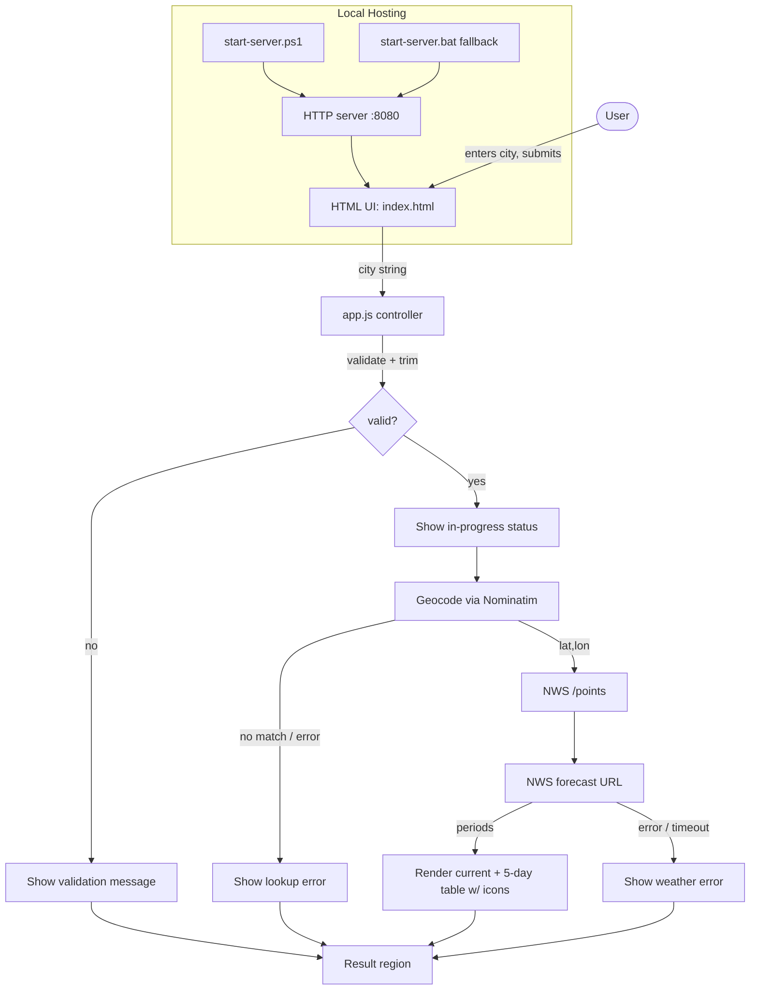
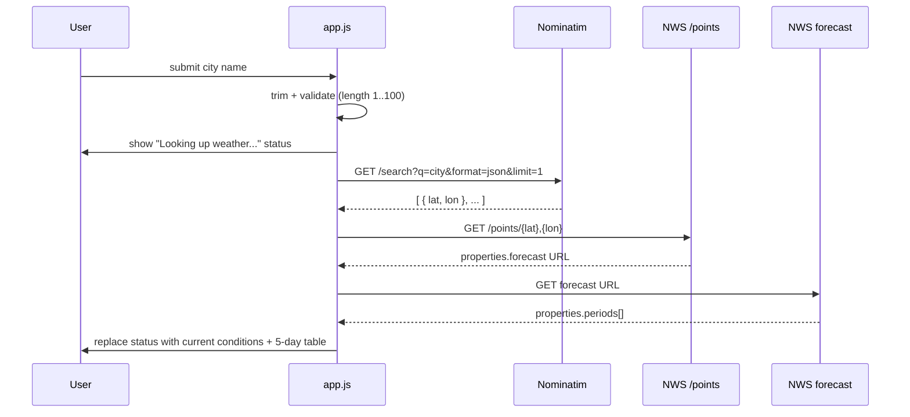

# Design Document

## Overview

The Weather App is a minimal single-page web application built with plain HTML and
JavaScript. A user types a United States city name, the app geocodes it to coordinates
using the Nominatim service, then queries the National Weather Service (NWS, weather.gov)
API to display current conditions and a 5-day forecast with weather icons. The app shows a
single in-progress status while a lookup runs and surfaces clear error messages when any
step fails. It is served locally on `http://localhost:8080` by a PowerShell script, with a
batch script fallback for path-related startup issues.

The design is intentionally simple to meet the project's ~20-minute completion goal:
no caching, no classes, no interfaces, no hardcoded city data, and no heavyweight test
infrastructure. The only validation requirement is that the JavaScript passes
`node --check`.

### Research Findings

Two external services drive the lookup. Both support cross-origin browser requests, which
is why they were chosen (avoiding CORS failures was an explicit requirement).

- **Nominatim geocoding** ([Nominatim Search API](https://nominatim.org/release-docs/develop/api/Search/),
  [Usage Policy](https://operations.osmfoundation.org/policies/nominatim/)):
  A free-form search request `GET https://nominatim.openstreetmap.org/search?q={city}&format=json&limit=1`
  returns a JSON array of matches. The first element exposes string fields `lat` and `lon`.
  An empty array means "not found." The usage policy asks for a descriptive request and a
  low request rate; a single user-driven lookup per submission stays well within limits.
  Content was rephrased for compliance with licensing restrictions.

- **National Weather Service API** ([API Web Service](https://www.weather.gov/documentation/services-web-api),
  [Gridpoint FAQ](https://weather-gov.github.io/api/gridpoints)):
  The NWS API is a two-step, coordinate-based REST/JSON service that needs no API key.
  First, `GET https://api.weather.gov/points/{lat},{lon}` returns metadata whose
  `properties.forecast` field is the URL of the forecast resource for that location.
  Fetching that URL returns `properties.periods`, an ordered array of forecast periods.
  Each period includes `name` (e.g. "Tonight", "Monday"), `temperature` (number),
  `temperatureUnit` ("F"), `shortForecast` (text such as "Sunny" or "Rain Likely"), and
  `icon` (an image URL). The service recommends sending a descriptive `User-Agent`.
  Content was rephrased for compliance with licensing restrictions.

Because weather.gov periods represent day and night halves, the "current conditions" come
from the first period, and the "5-day forecast" is derived by taking daytime periods from
the ordered list.

## Architecture

The app has three layers kept as plain functions in a single JavaScript file, plus a static
HTML shell and local server scripts.



Request sequence for a successful lookup:



### Key Design Decisions

- **Plain functions over classes/interfaces.** The steering rules forbid classes and
  interfaces, and the scope is small, so logic lives in small named functions
  (`validateCity`, `geocode`, `getForecast`, `pickDailyPeriods`, `iconFor`, `render*`).
- **Pure core, thin I/O edge.** Validation, period selection, temperature formatting, and
  icon selection are pure functions so they are easy to reason about and verify. Only the
  fetch wrappers touch the network. This keeps the testable logic separate from I/O.
- **Single status region.** One DOM region shows exactly one of: in-progress status,
  results, or an error. This directly satisfies the "at most one status" requirement and
  keeps state handling trivial without a state framework.
- **No stored city data.** The user's trimmed input is passed straight into the Nominatim
  query string; nothing is hardcoded or persisted, satisfying the no-stored-data rule.
- **Timeouts via `AbortController`.** Each network call is bounded (10 seconds) so a hung
  request produces a clean error message rather than a stuck in-progress state.

## Components and Interfaces

All components are plain functions in `app.js`, wired to the DOM by an event listener. No
classes or interfaces are defined.

### HTML shell (`index.html`)
- A text input (`#city-input`, `maxlength` 100) for the City_Name.
- A submit control (`#search-button`) and form submit handling.
- A single result region (`#status`) used for the in-progress message, results, or errors.
- A loads `app.js`.

### Controller (`app.js`)
- `onSubmit(event)` — prevents default, reads and trims input, runs validation, drives the
  in-progress status, orchestrates geocode -> points -> forecast, and routes success/error
  to the render functions.

### Validation (pure)
- `validateCity(raw)` -> `{ ok: true, city }` or `{ ok: false, message }`.
  Trims input; rejects empty/whitespace-only and inputs longer than 100 characters, each
  with its own message.

### Geocoding (I/O)
- `geocode(city, signal)` -> `Promise<{ lat, lon } | null>`.
  Calls Nominatim `search`; returns coordinates of the first match, or `null` when the
  result array is empty. Throws on network/HTTP error or abort (timeout).

### Weather (I/O + pure helpers)
- `getForecast({ lat, lon }, signal)` -> `Promise<Array<Period>>`.
  Calls `/points/{lat},{lon}`, follows `properties.forecast`, returns `properties.periods`.
  Throws on network/HTTP error or abort.
- `pickDailyPeriods(periods)` -> `Array<Period>` (pure).
  Returns the first 5 daytime periods (`isDaytime === true`), falling back to the first 5
  periods if daytime flags are absent, used to build the 5-day table.
- `formatTemp(value, unit)` -> `string` (pure). Rounds to the nearest whole degree and
  appends a Fahrenheit unit label (e.g. `72°F`).
- `iconFor(shortForecast)` -> `string` (pure). Maps a textual condition to a weather icon
  category (sunny, cloudy, rainy, snowy, stormy, foggy, default) by keyword matching, and
  returns the icon glyph/emoji for that category.

### Rendering (pure-ish DOM writers)
- `renderStatus(text)` — writes the single in-progress status message.
- `renderCurrent(period)` — writes current temperature (°F) + short forecast + icon.
- `renderForecastTable(periods)` — writes a table with one row per day: day, temperature,
  short condition, and icon.
- `renderError(message)` — writes an error message, clearing any prior content.

### Local hosting
- `start-server.ps1` — starts an HTTP server bound to `localhost:8080`, prints the
  availability message, and reports when the port is already in use.
- `start-server.bat` — fallback that starts the same server at `localhost:8080` when path
  issues block the PowerShell script.

## Data Models

The app uses plain JavaScript objects; no classes. Shapes reflect only the fields consumed.

### ValidationResult
```
{ ok: boolean, city?: string, message?: string }
```

### Coordinates
```
{ lat: string, lon: string }   // as returned by Nominatim; used directly in NWS URL
```

### Nominatim result element (subset consumed)
```
{ lat: string, lon: string, display_name: string }
```

### NWS points response (subset consumed)
```
{ properties: { forecast: string /* forecast resource URL */ } }
```

### Period (NWS forecast period, subset consumed)
```
{
  name: string,            // "Tonight", "Monday", ...
  isDaytime: boolean,
  temperature: number,
  temperatureUnit: string, // "F"
  shortForecast: string,   // "Sunny", "Rain Likely", ...
  icon: string             // NWS icon URL (optional display)
}
```

### IconCategory
```
"sunny" | "cloudy" | "rainy" | "snowy" | "stormy" | "foggy" | "default"
```

### UI state (implicit, single region)
At any moment the `#status` region holds exactly one of: in-progress status, rendered
results (current + forecast table), or an error message.

## Correctness Properties

*A property is a characteristic or behavior that should hold true across all valid
executions of a system — essentially, a formal statement about what the system should do.
Properties serve as the bridge between human-readable specifications and machine-verifiable
correctness guarantees.*

The properties below apply to the pure core of this app: input validation, coordinate
selection, temperature formatting, icon selection, daily-period selection, and the
single-status rendering invariant. The network calls, timeouts, status transitions, and
the local HTTP server are verified with example/integration tests instead (see Testing
Strategy), because their behavior does not vary meaningfully with generated input.

### Property 1: City validation accepts valid input (trimmed) and rejects invalid input

*For any* input string, `validateCity` returns `ok = true` with `city` equal to the input's
trimmed value when the trimmed length is between 1 and 100 inclusive; otherwise (trimmed
value empty/whitespace-only, or trimmed length greater than 100) it returns `ok = false`
with a non-empty message, and in the rejected case no geocoding request is made.

**Validates: Requirements 1.3, 1.4, 1.5, 2.1, 2.2, 4.6**

### Property 2: Geocoding selects the first match or reports not found

*For any* Nominatim result array, coordinate selection returns the `lat`/`lon` of the first
element when the array is non-empty, and returns `null` (the not-found path, with no weather
lookup) when the array is empty.

**Validates: Requirements 2.3, 2.4**

### Property 3: Temperature formatting rounds to the nearest whole degree with a Fahrenheit label

*For any* finite numeric temperature value, `formatTemp` produces a string whose numeric part
equals `Math.round(value)` and which includes a Fahrenheit unit label.

**Validates: Requirements 3.2**

### Property 4: Icon selection is a total function over textual conditions

*For any* textual forecast string, `iconFor` returns exactly one icon drawn from the known
category set (sunny, cloudy, rainy, snowy, stormy, foggy, default), never returning empty,
and mapping any text with no recognized keyword to the default icon.

**Validates: Requirements 3.3**

### Property 5: Daily period selection yields an ordered prefix of at most five days

*For any* array of forecast periods, `pickDailyPeriods` returns an order-preserving
subsequence of the input of length `min(5, available)` and never returns more than 5 periods.

**Validates: Requirements 3.4**

### Property 6: The result region shows at most one status at a time

*For any* single render operation (in-progress status, results, or error) applied to the
result region, after the operation the region contains exactly one of those three kinds of
content, with any previously displayed content cleared.

**Validates: Requirements 4.5, 4.2**

## Error Handling

All error and empty-state paths resolve to a single visible message written into the shared
result region, replacing any in-progress status so the user is never left with a stuck
spinner.

- **Empty / whitespace-only city (1.4, 2.2, 4.6):** `validateCity` rejects before any network
  call; a "please enter a city name" message is shown and no in-progress state is entered.
- **Over-length city (1.5):** `validateCity` rejects with a length message; no network call.
- **City not found (2.4):** empty Nominatim array yields `null`; a "city not found" message
  replaces the in-progress status; no weather lookup.
- **Geocoding failure / timeout (2.5):** fetch rejection, non-OK HTTP status, or a 10-second
  `AbortController` timeout produces a "location lookup failed" message; the entered city text
  is retained in the input.
- **Weather conditions unavailable (3.5):** when the first/forecast periods lack a temperature
  or textual forecast, a "weather conditions unavailable" message is shown.
- **Weather failure / timeout (3.6):** fetch rejection, non-OK HTTP status, or a 10-second
  timeout on the `/points` or forecast request produces a "weather lookup failed" message.
- **Port in use (5.5):** the startup script detects a bind failure on 8080 and prints a
  port-unavailable message without serving.
- **Path issues starting the server (5.6):** the batch script fallback serves the app at
  `localhost:8080` when the PowerShell script cannot run.

Each network call is wrapped so that a thrown error or abort is caught by the controller and
routed to `renderError`, guaranteeing the single-status invariant (Property 6) holds even on
failure.

## Testing Strategy

Per the project steering rules, testing is intentionally minimal: validity of the JavaScript
is confirmed with `node --check`, and no heavyweight test framework is required. The strategy
below describes how each behavior would be verified; property tests target the pure core.

### Validity check (required)
- Run `node --check app.js` (and any script JS) to confirm the JavaScript parses. This is the
  baseline acceptance gate for this project.

### Property-based tests (pure core)
If property-based tests are added, use an existing property-testing library for JavaScript
(for example, fast-check) — do not implement property testing from scratch. Each property test
runs a minimum of 100 iterations and is tagged with a comment referencing its design property
using the format: **Feature: weather-app, Property {number}: {property_text}**.

- Property 1 — `validateCity` over arbitrary strings (including whitespace-only, boundary
  lengths 100/101, and surrounding-whitespace cases). One property test.
- Property 2 — coordinate selection over arbitrary result arrays (empty and non-empty). One
  property test.
- Property 3 — `formatTemp` over arbitrary finite numbers (negatives, decimals, `.5` cases).
  One property test.
- Property 4 — `iconFor` over arbitrary strings (known keywords and unknown text -> default).
  One property test.
- Property 5 — `pickDailyPeriods` over arbitrary period arrays of varying length and
  `isDaytime` flags. One property test.
- Property 6 — a chosen render operation applied to a fresh region, asserting exactly one
  content kind remains. One property test.

Generators should also exercise the edge cases from requirement 3.5 (periods missing
temperature or `shortForecast`) so the "unavailable" guard is covered.

### Example / integration tests (I/O, status flow, server)
These behaviors do not vary meaningfully with generated input and are better covered by a few
representative examples (with `fetch` mocked where applicable):
- Geocoding and weather failure/timeout paths (2.5, 3.6) — mocked rejecting/timed-out fetch.
- NWS two-step orchestration (3.1) — mocked `/points` + forecast responses.
- In-progress status flow and transitions (4.1–4.4, 4.6) — assert in-progress appears on
  submit and is replaced by results or error on completion.
- Local server (5.1–5.6) — smoke/manual run: server reachable at `localhost:8080`, serves
  `index.html`/`app.js`, returns not-found for missing paths, prints the availability message,
  reports port-in-use, and the batch fallback serves the app.
